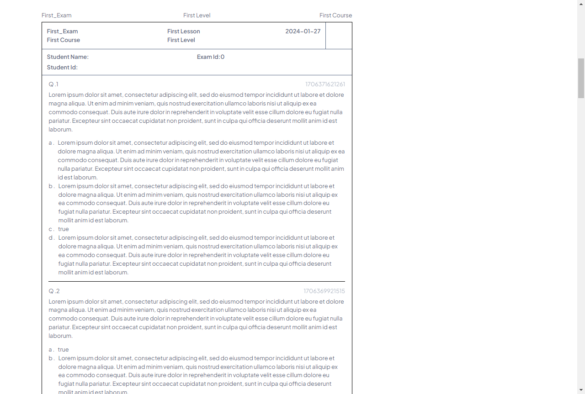
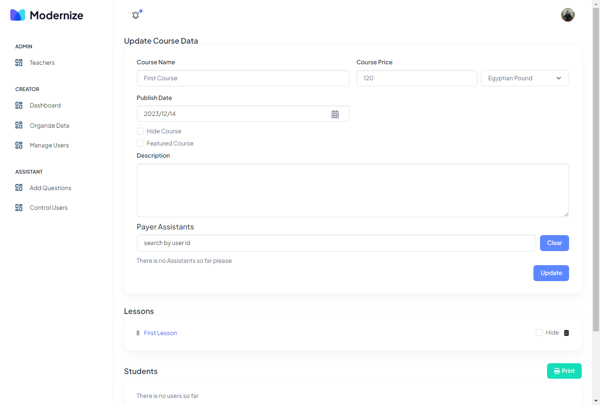

## Admin Panel for Courses Site

 robust web application designed to streamline the management of an online courses platform. Leveraging modern web technologies and a comprehensive feature set, this project empowers administrators to efficiently manage users, payments, courses, lessons, exams, and student results. Built using Next.js for static rendering, Firebase for real-time data handling, and a combination of popular CSS frameworks like Sass, Bootstrap, and Tailwind CSS, this project sets a solid foundation for creating and maintaining a dynamic e-learning platform.




<!-- ## Live Demo

You can access the live demo [here](https://disney-olj2.onrender.com/). -->


# Features

1.  User Management:

    -  Create, edit, and manage user profiles.
    - Implement user authentication with options for phone, email, and password login methods.
    - Block or unblock users as needed.
    Payment Management:

    - Handle course payments with various methods, including admin-initiated enrollments and code-based activations.
    - Activate user access to specific courses upon successful payment.
2. Course Management:

    - Add, edit, and manage courses, including essential details such as course name, description, level, pricing, and publication status.
    - Organize courses into different levels for easy navigation.
    - Feature courses to highlight them on the platform.
3. Lesson Management:

    - Create, organize, and edit course lessons, complete with names, descriptions, video content (via YouTube), and publication status.
    - Associate lessons with specific courses for structured learning experiences.
4. Exam and Question Management:
    - Design exams with customizable options, including exam name, description, time limits, and randomization settings.
    - Add questions to exams using the Draft.js editor, allowing rich text formatting.
    - Shuffle or unshuffle questions for exam variation.
5. Question Bank:
    - Maintain a bank of questions with multiple-choice options and correct answers.
    - Associate questions with specific lessons for easy reference when creating exams.
6. Results Tracking:

    - Record student exam results, including question-wise details such as visited/unvisited, marked for review, answers submitted, and correct/incorrect responses.
    - Track exam start and end times.
    - Monitor user progress and performance over time.
    Real-Time Updates:

    - Utilize Firebase's real-time database capabilities for instant data synchronization and live updates.
    - Ensure a responsive and interactive user experience.
7. Responsive Design:

    - Implement responsive web design principles to ensure the platform functions seamlessly on various devices and screen sizes.
8. Security:

    - Maintain user data security with authentication and authorization features.
    - Protect sensitive information like passwords and payment details.
9. Search and Filtering:

    - Enable efficient searching and filtering of courses and user profiles to improve user navigation.
10. Documentation and Codebase:

    - Provide clear and well-documented code for easy maintenance and scalability.
    - Use popular UI component libraries like Material-UI to enhance the user interface.

## Getting Started

To run the project locally, follow these steps:

1. Clone the repository:

   ```shell
   git clone https://github.com/Emam546/courses-site
   ```
2. Install the dependencies:

   ```shell
   npm install
   ```

3. Start the development server:

    ```shell
   npm run dev
   ```

